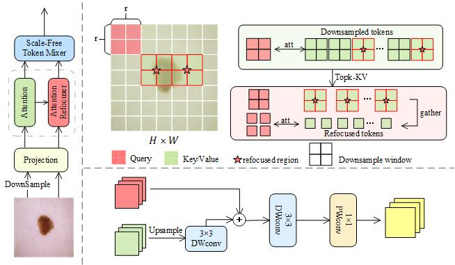

# RefViT: Refocusing Vision Transformer

Accurate medical image classification, challenged by distinct local lesion features and scattered global features in the images, is essential for assisting doctors in effectively detecting and diagnosing diseases. Current methods have attempted to utilize Vision transformers (ViTs) for medical classification tasks, as the multi-head self-attention (MHSA) mechanism in ViTs is beneficial for capturing long-range dependencies and modeling global semantic information. However, these methods can result in insufficient fine-grained local information, too many parameters, and expensive computational costs.

To address these issues, we propose a **ref**ocusing **Vi**sion **T**ransformer (RefViT) and a **d**ual **r**efocusing **a**ttention (DRA) mechanism. 

## Overview

RefViT aims to enhance medical image classification by:
1. Adopting a four-stage pyramid structure to extract comprehensive features encompassing both local and global information.
2. Leveraging parameter reuse and attention-based similarity scores through the DRA mechanism, replacing the standard MHSA to reduce parameters and computational costs.

